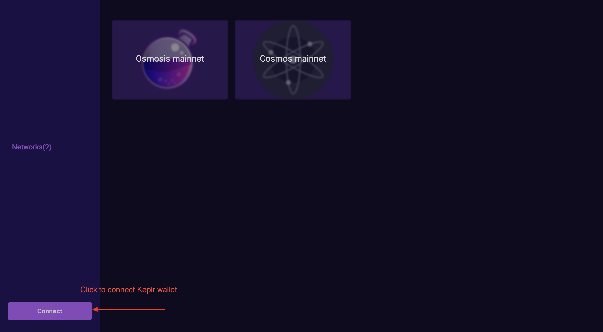
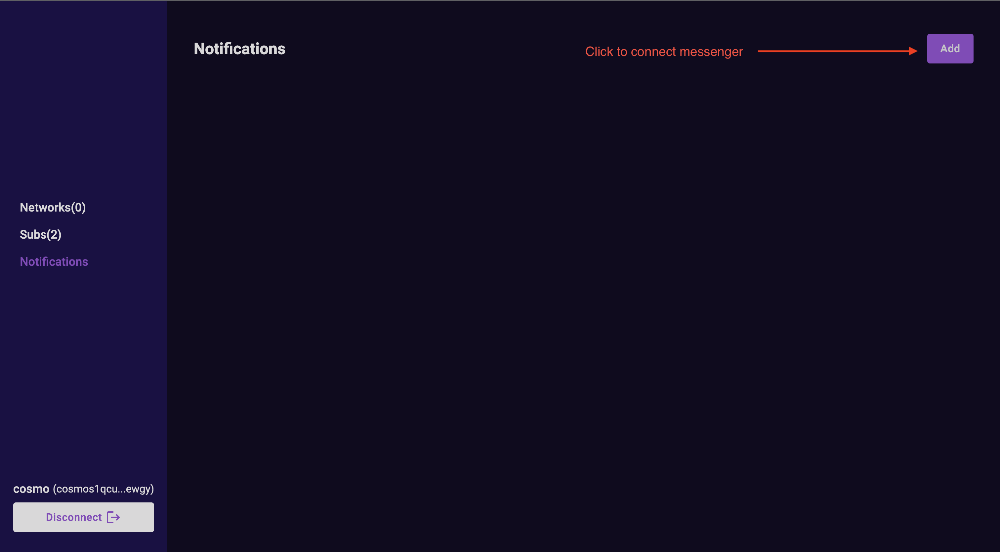
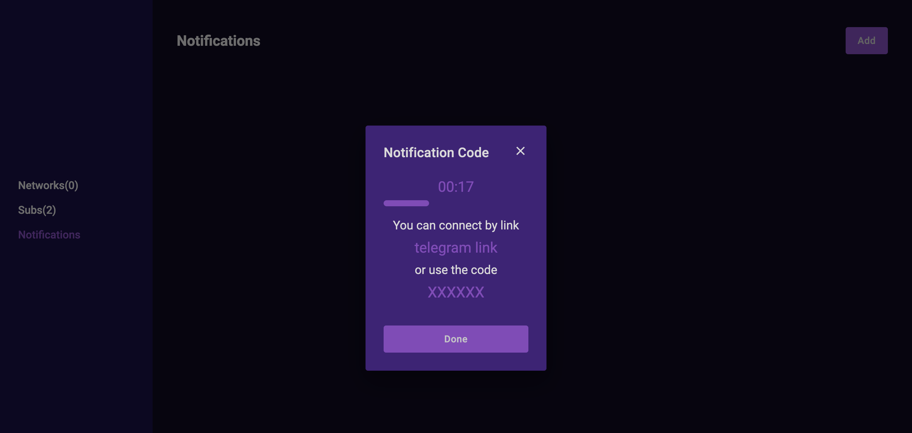
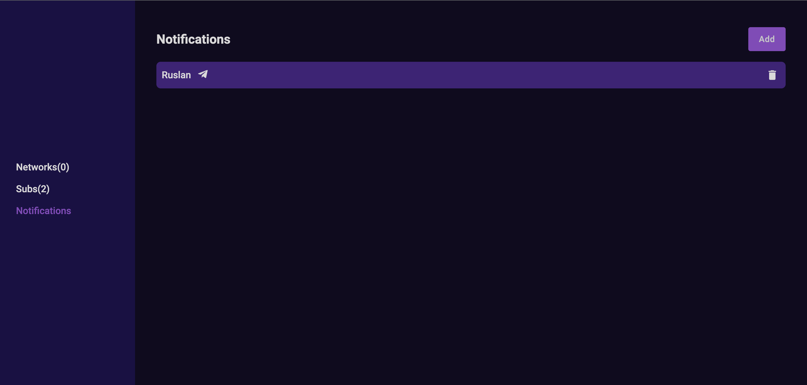
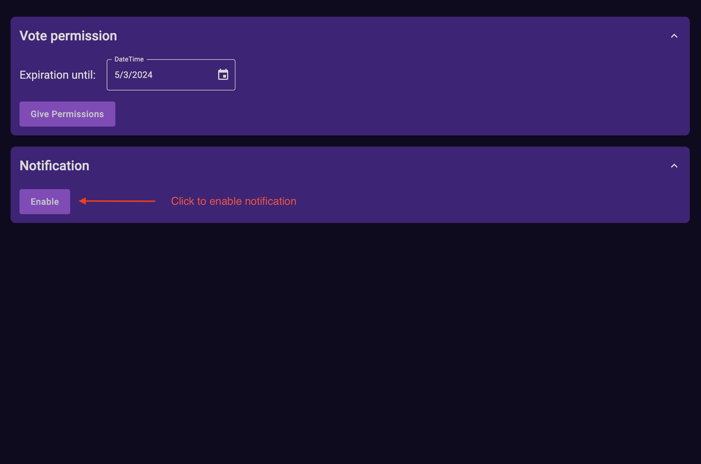
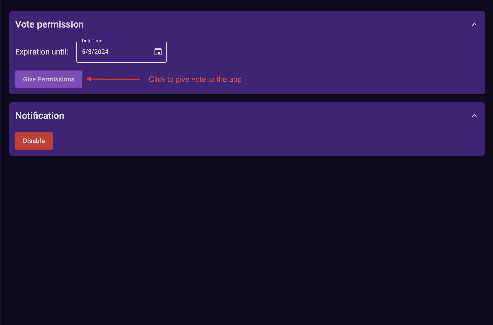
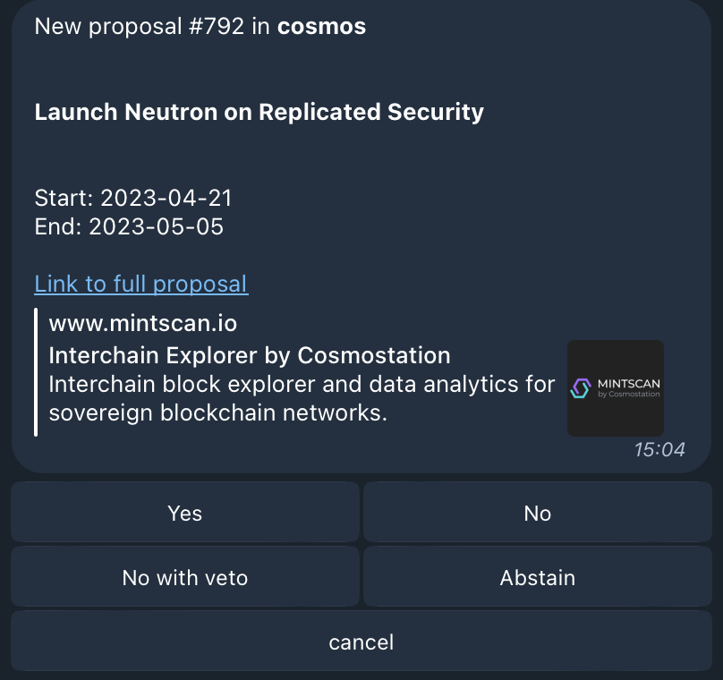

# W!Signal tutorial

W!Signal is an app (developed by MELLIFERA team) that let you connect a messenger to app to receive proposal notifications in your messenger and vote by permission without transaction fees ***directly*** in the chat.

We support the following messengers:
- Telegram

***To get access to beta test please fill the [form](https://docs.google.com/forms/d/e/1FAIpQLSfz4gGuIDptTKQySlKdAfuLJsOvIhUwG6DicFbuVyFXGgswcQ/formResponse) and contact to us in this https://t.me/wsignalbetachat telegram group***

## Tutorial

### 1. Connect Wallet
Go to the site https://beta.wsignal.net/networks

### 2. Connect Telegram to the app 
Go to the Notification tab and click on "add" button

In the opened window click on "add" button, then you will see fallowing window

To connect telegram to the app you have few options:
- Click on "telegram link" this link will open telegram app, and you will be able to connect telegram to the app
- Send secret code to the bot in telegram chat https://t.me/@wsignal_beta_bot

After connect you will see connected telegram in the app

### 3. Enable notification and give permissions for specific network. All of it will allow you vote in the telegram chat

To start receive notification about proposal go to the "Networks" tab and now you can enable notifications for specific network

Now you will receive notification about new proposal in the telegram chat, but you can't vote yet, because you need to give permission for the network

To give permission for network you have to give Vote permission to the app. To do it click "Give permission" button

---
You always can revoke permission for the app in your wallet or in the app 

### 4. Vote in the telegram chat

After you did all the previous steps you can vote in the telegram chat. 
You will receive notifications about new proposals in the telegram chat with buttons to vote

### Enjoy!
That's all! If you have any questions, please contact us in the telegram group https://t.me/wsignalbetachat

